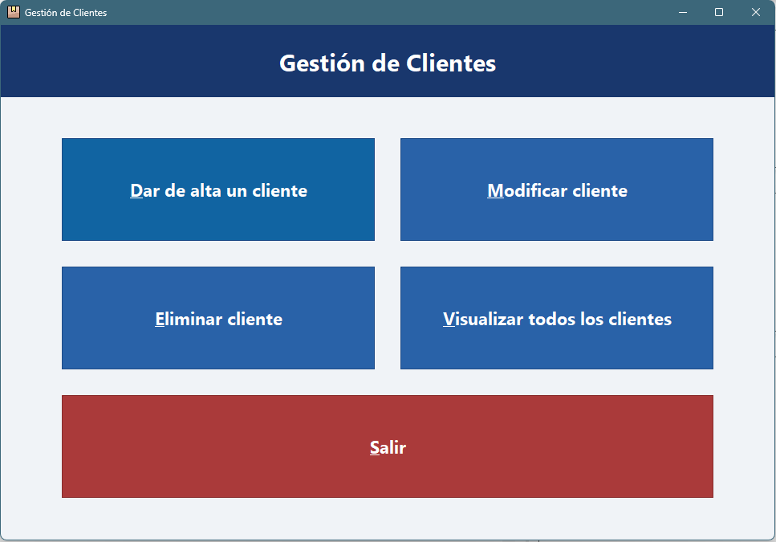
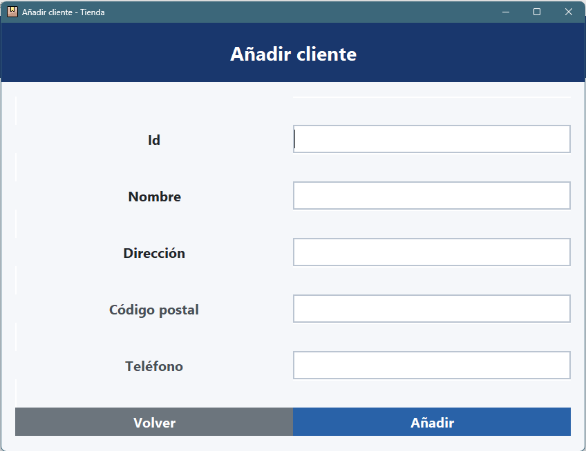
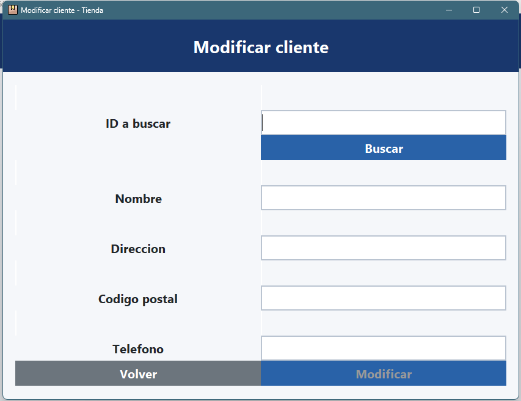
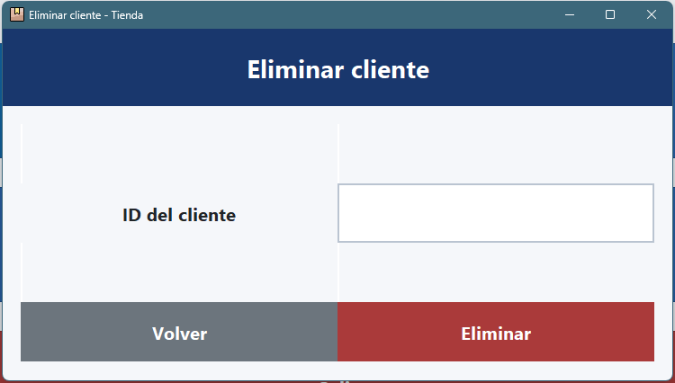
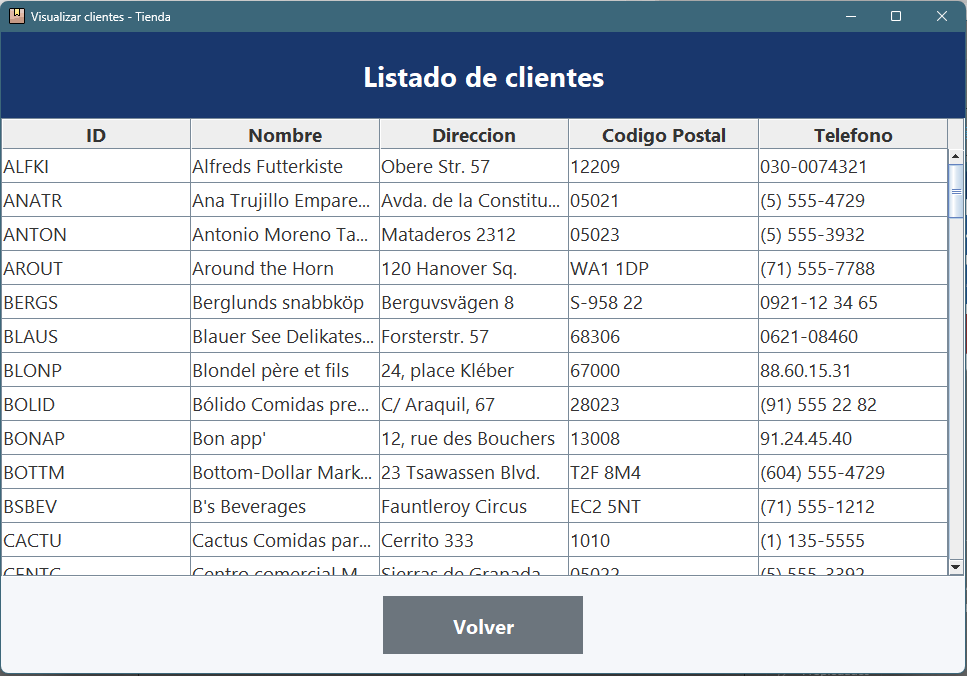

# Gestión de Clientes

Aplicación de escritorio hecha en Java Swing para gestionar clientes de una tienda.

## Qué hace

- Dar de alta clientes.
- Modificar clientes existentes.
- Eliminar clientes.
- Ver el listado completo de clientes.

## Pantallas

La interfaz principal muestra un menú simple con acceso a cada ventana de la app.

Alta de cliente.

Modificación de cliente.

Eliminación de cliente.

Listado de clientes.

## Video

Hay un video corto con el funcionamiento general de la aplicación en:

- [assets/Funcionamiento.mp4](assets/Funcionamiento.mp4)

## Base de datos

La app conecta con MySQL usando la base de datos `2ebal_almacen`.

El script está en:

- [SwingTienda/sql/almacen.sql](SwingTienda/sql/almacen.sql)

## Estructura

- `src/view`: ventanas de la interfaz.
- `src/controller`: controladores de eventos.
- `src/dao`: acceso a datos.
- `src/model`: modelo de cliente.
- `assets/img`: capturas de pantalla.
- `assets/Funcionamiento.mp4`: video de demostración.